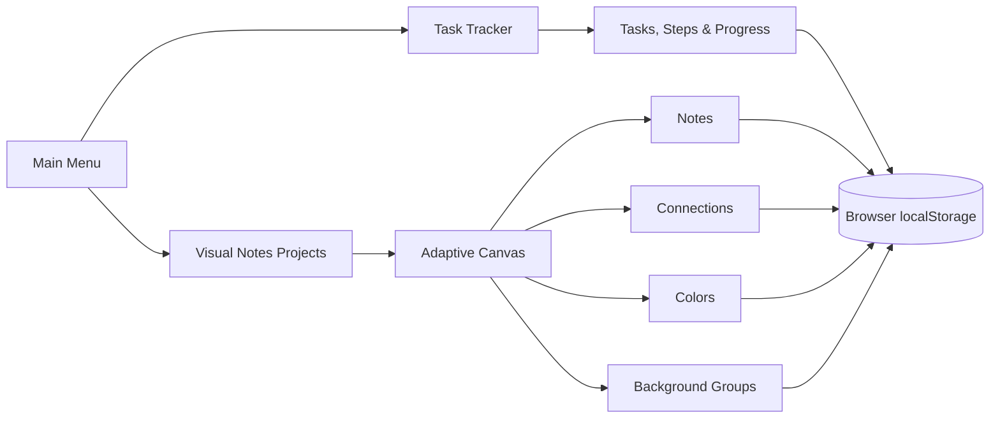

<div align="center">

# ✦ Visual Notes

### Turn scattered thoughts into connected ideas — and ideas into action.


A lightweight, browser-based thinking space that combines a visual idea canvas with a practical task tracker. No account, backend, build step, or installation required.

</div>

---

## What you can do

### 🧠 Think visually

- Create multiple visual-note projects.
- Place, move, resize, and edit nodes on a large canvas. Each node has a title and can optionally contain a note.
- New nodes begin as compact, title-only cards; select one and use its **+** button to add note content.
- Connect related nodes with structured, right-angle paths to build clear idea maps.
- Draw titled, resizable, translucent colored background shapes to visually group related nodes.
- Color groups of nodes and see connections blend between their colors.
- Reset nodes or shapes to the app's original theme with the **Default** color preset, restoring standard connection colors.
- Select and move several nodes together.
- Optionally snap nodes and shapes to the canvas dots while moving or resizing them.
- Pan and zoom through complex boards.
- Export an entire board as a high-quality PNG image.
- Keep the workspace uncluttered with dedicated **Edit**, **Save**, and **Export** menus.

### ✅ Turn ideas into action

- Create tasks and break them into smaller steps.
- Track completion with automatic progress counts and percentages.
- Reorder tasks and steps with drag and drop.
- Pin important tasks and attach extra notes.
- Organize work into custom categories.

### 🔒 Keep everything local

Your projects and tasks stay on your device. Browser storage keeps the app fast, while the canvas's **Save** menu—and the **Backups** panel on other pages—can download a complete workspace backup or mirror changed data to a local JSON file every five minutes in supported browsers. Pending changes are also written when you use the app's menu-return buttons or press **Ctrl/Cmd + S**. Visual Notes has no server and sends no workspace data anywhere.

## How it fits together



## Run it

1. Download or clone this repository.
2. Open `index.html` in a modern browser.
3. Start mapping ideas or tracking tasks.

```bash
git clone https://github.com/SzymonRembalski/visual-notes.git
cd visual-notes
```

Then open `index.html`. There is nothing to install and no build command to run.

> [!IMPORTANT]
> Browser data belongs to the profile and origin where you created it. On the canvas, use **Save → Choose auto-backup file** or **Save → Download backup** to keep a copy that survives clearing browser data. Use **Save → Restore backup** to restore it. The same options remain under **Backups** on the other pages.

## Useful canvas controls

| Action | Control |
| --- | --- |
| Create a node | **Edit → New Node** |
| Add a note inside a node | Select one title-only node, then use the **+** beneath its title; an empty note collapses automatically |
| Resize a node | Left-drag any border or corner; image nodes keep their proportions |
| Move around the canvas | Right-click and drag |
| Center the camera | Select one or more nodes and press the mouse wheel; without a selection, it centers on all nodes |
| Navigate a larger node area | Drag or click the horizontal and vertical position bars |
| Save to the connected backup file | **Ctrl/Cmd + S** |
| Save the full board as an image | **Export → Export PNG** |
| Zoom | Mouse wheel (`0.2×`–`1×`) |
| Simplified overview | Use `0.2×`–`0.3×` to show readable titles, image previews, shapes, and connections |
| Image-only nodes | Display without titles in both normal and simplified views |
| Select several nodes | Drag on empty canvas or `Shift` + click |
| Delete selected nodes | `Delete` |
| Undo the last change | `Ctrl` + `Z` |
| Redo an undone change | `Ctrl` + `Shift` + `Z` |
| Connect nodes | Use **Edit → Add Connections**, then draw through nodes |
| Remove links | Use **Edit → Remove Connections**, then draw through connections |
| Color nodes | Use **Edit → Color Mode**, then left-click one node, `Shift` + click to select more, or drag a selection box; choose a color and apply |
| Reset colors | Choose the crossed-out **Default** swatch and apply it to remove custom node or shape colors |
| Reuse a board color | In **Color Mode**, choose **Pick**, then click a node or shape |
| Create a background group | Use **Edit → Shapes Mode**, then drag on empty canvas |
| Color a background group | Enable **Shapes Mode** and **Color Mode** from **Edit**, select a shape, choose a color, and apply |
| Edit a group | In **Shapes Mode**, drag it to move, click its title to rename, or drag an edge/corner to resize |
| Delete a group | Select it in **Shapes Mode**, then press `Delete` or use its × button |
| Toggle grid snapping | Use **Edit → Snap: ON/OFF**; each project remembers the setting |

## Project structure

```text
visual-notes/
├── index.html                # Main navigation
├── projects.html             # Visual project library
├── visual-notes.html         # Visual notes workspace
├── tasks.html                # Task tracker
└── assets/
    ├── css/
    │   └── styles.css        # Shared dark interface
    └── js/
        ├── app.js            # Page initialization and action bindings
        ├── board-image-exporter.js # Full-board PNG renderer and download
        ├── canvas-utils.js   # Canvas coordinates, bounds, and geometry
        ├── history-manager.js # 30-step undo and redo history
        ├── project-manager.js # Project persistence
        ├── projects-page.js  # Project library interface
        ├── task-tracker.js   # Task tracker behavior
        └── visual-notes.js   # Canvas and note interactions
```

## Built with

Plain HTML, CSS, and JavaScript — intentionally. The project stays easy to open, understand, modify, and carry anywhere.

---

<div align="center">

**Map the thought. Connect the idea. Finish the task.**

</div>
