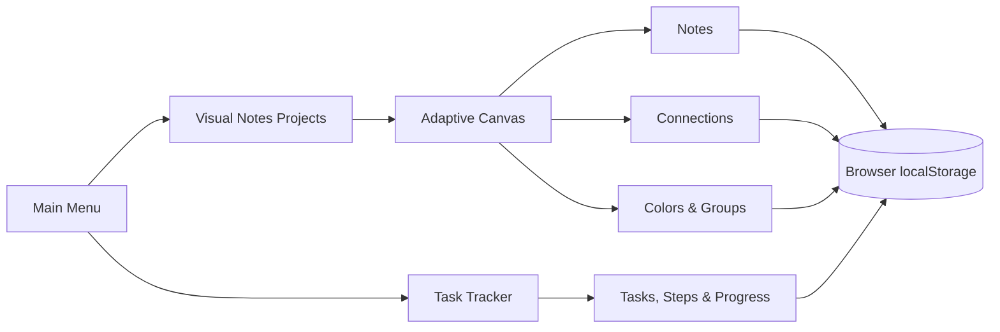

<div align="center">

# ✦ Visual Notes

### Turn scattered thoughts into connected ideas — and ideas into action.


A lightweight, browser-based thinking space that combines a visual idea canvas with a practical task tracker. No account, backend, build step, or installation required.

</div>

---

## What you can do

### 🧠 Think visually

- Create multiple visual-note projects.
- Place, move, resize, and edit notes on a large canvas.
- Connect related notes to build idea maps.
- Color groups of notes and see connections blend between their colors.
- Select and move several notes together.
- Pan and zoom through complex boards.

### ✅ Turn ideas into action

- Create tasks and break them into smaller steps.
- Track completion with automatic progress counts and percentages.
- Reorder tasks and steps with drag and drop.
- Pin important tasks and attach extra notes.
- Organize work into custom categories.

### 🔒 Keep everything local

Your projects and tasks are saved in the browser with `localStorage`. Visual Notes has no server and sends no workspace data anywhere.

## How it fits together



## Run it

1. Download or clone this repository.
2. Open `index.html` in a modern browser.
3. Start mapping ideas or tracking tasks.

```bash
git clone https://github.com/SzymonRembalski/visual-notes.git
cd visual-notes
```

Then open `index.html`. There is nothing to install and no build command to run.

> [!IMPORTANT]
> Data belongs to the browser profile and origin where you created it. Clearing browser site data may remove saved projects and tasks.

## Useful canvas controls

| Action | Control |
| --- | --- |
| Create a note | **New Note** |
| Move around the canvas | Right-click and drag |
| Zoom | Mouse wheel |
| Select several notes | Drag on empty canvas or `Ctrl` + click |
| Delete selected notes | `Delete` |
| Connect notes | Turn on **Add Connections**, then draw through notes |
| Remove links | Turn on **Remove Connections**, then draw through connections |
| Color notes | Select notes, enable **Color Mode**, choose a color, and apply |

## Project structure

```text
visual-notes/
├── index.html                # Main navigation
├── projects.html             # Visual project library
├── canvas.html               # Visual notes workspace
├── tasks.html                # Task tracker
└── assets/
    ├── css/
    │   └── styles.css        # Shared dark interface
    └── js/
        ├── app.js            # Page initialization and action bindings
        ├── canvas-utils.js   # Canvas coordinates, bounds, and geometry
        ├── project-manager.js # Project persistence
        ├── projects-page.js  # Project library interface
        ├── task-tracker.js   # Task tracker behavior
        └── visual-notes.js   # Canvas and note interactions
```

## Built with

Plain HTML, CSS, and JavaScript — intentionally. The project stays easy to open, understand, modify, and carry anywhere.

---

<div align="center">

**Map the thought. Connect the idea. Finish the task.**

</div>
